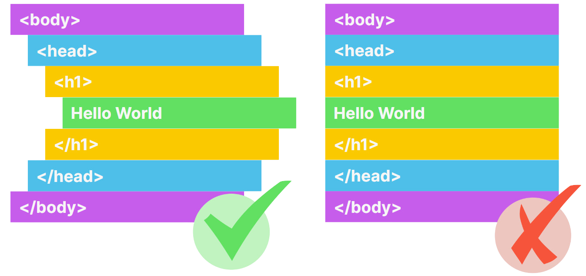
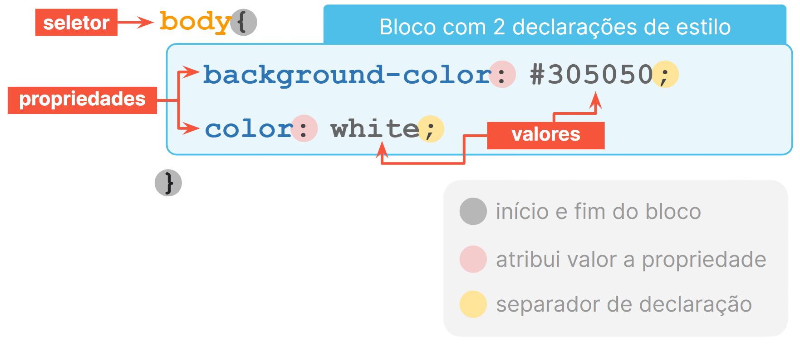

# 2024-Mat2-OlaMundo

## Recursos

1. [Propótico de alta fidelidade](https://www.figma.com/file/P2RnuaKEOOeQdqXgcqhTzZ/Hello-Word%3A-Minha-primeira-p%C3%A1gina-para-web?type=design&node-id=0-1&mode=design);
1. [Imagem](https://raw.githubusercontent.com/silviosnjr/Hello-World/Aula04Video04/imagem/Ol%C3%A1%20Mundo.png);

## Rúbricas

### Aula 1

1. Utilizar a estrutura básica do html;
1. Modificar a linguagem da página para o padrão português brasileiro (pt-br);
1. Modificar o charset, modificar a largura da página para a largura do dispositivo;
1. Modificar o título da página;

### Aula 2

1. Utilizar as tags semânticas: header, section, footer;
1. Uitlizar as tags de título e parágrafo;

### Aula 3

1. Criar diretório para organizar as imagens;
1. Fazer download do arquivo de imagem e utilizar a tag de imagem para incluí-la na página;

### Aula 4

1. Indentação do código;

### Aula 5

1. Criar estila para o seletor dos títulos de nível 2, cor da fonte laranja;
1. Vincular a folha de estilo à página index.html;

### Aula 6

1. Criar estilo para o seletor do corpo da página, cor de fonte e cor da fonte;
1. Sintáxe do CSS com seletor tag do html;

### Aula 7

1. Utilizar alinhamento centralizado para o corpo da página;
1. Utilizar borda inferior para o cabeçalho da página. Borda sólida, cor cinza;
1. Utilizar borda superior no rodapé da página. Borda sólida, cor cinza;

### Aula 8

1. Utilizar tag span e identificador para especificar uma região do html e atribuir a elas estilo personalizado;
1. utilizar tag span e class para especificar regiões do html e atribuir a elas estilo personalizado;
1. Utilizar negrito e itálico para modificar o estilo das regiões acima;
1. Utilizar seletores no css para id e class;

### Aula 9

1. Utilizar javascript para interação com o usuário da página;
1. Utilizar javascript para pedir o nome do usuário;
1. Motificar parágrafo do header para informar o nome do usuário na mensagem de boas-vendas;
1. Enquanto usuário não informar nenhum nome, deve solicitar novamente; caso cancela o prompt, utilizar a palavra estudante;

## Para saber mais:

1. [Mozilla Foundation](https://developer.mozilla.org/pt-BR/docs/Web/HTML)
1. [W3C](https://www.w3.org/TR/2011/WD-html5-20110405/)
1. [Cores](https://www.w3schools.com/cssref/css_colors.php)